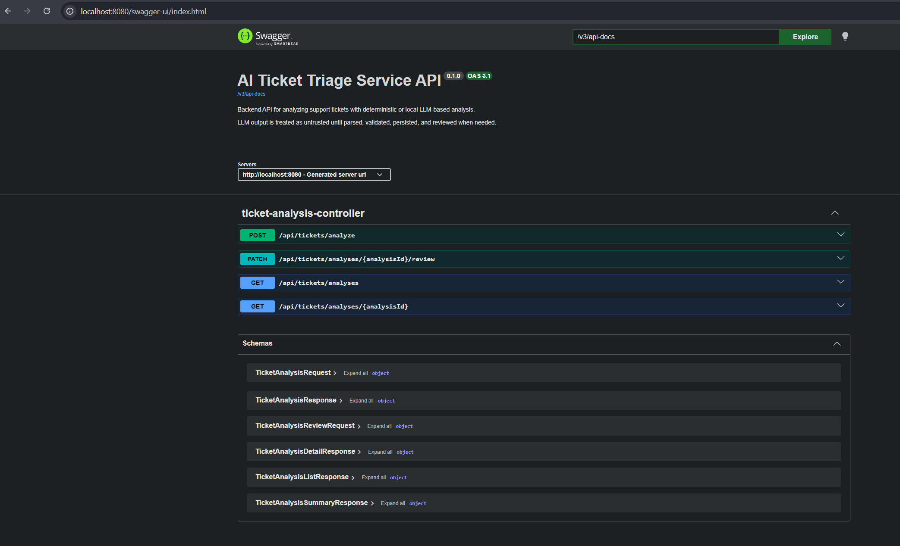
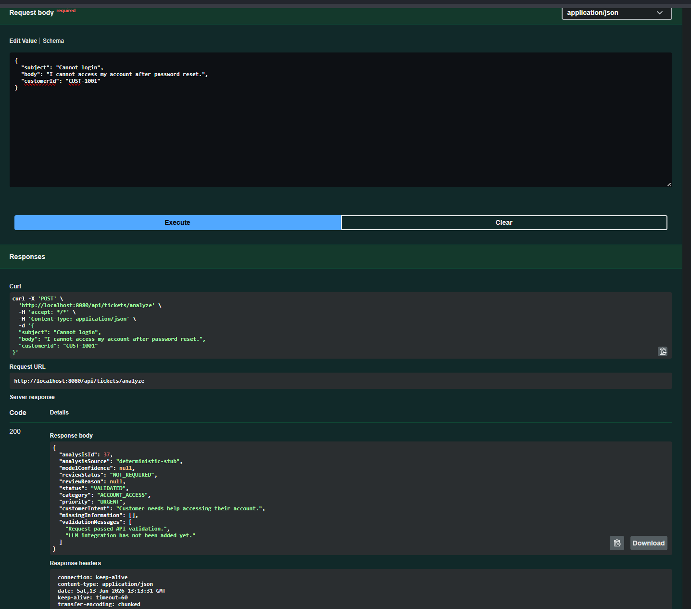

# AI Ticket Triage Service

Java/Spring Boot AI backend for structured support ticket triage with validated LLM output, persistence, auditability, and review decisioning.

## Project Goal

This project demonstrates how traditional backend engineering can be combined with practical AI workflow design.

The service accepts support tickets, analyzes them using either a deterministic analyzer or a local Ollama model, validates the structured analysis result, persists both raw and validated output, and exposes APIs for retrieval and review workflows.

## Demo Screenshots

The following screenshots are stored in `docs/images/` and illustrate the application running locally.

### Swagger UI

Swagger UI exposes the backend API for local inspection and testing without requiring a separate frontend application.



### Ticket Analysis Response

This example shows the response returned after submitting a support ticket for analysis, including the structured triage output that is persisted by the system.



## Why This Project Exists

LLM output should not be trusted just because it looks correct.

This project treats AI output as untrusted until it passes controlled parsing, validation, persistence, and review decision rules.

The focus is not building a chatbot. The focus is building a production-aware backend service around AI output.

## Architecture Flow

The service follows a validation-first AI workflow:

```text
Support Ticket Request
        |
        v
Analyzer Selection
(deterministic or Ollama)
        |
        v
Raw Analyzer Output
        |
        v
Parser Layer
        |
        v
Validation Layer
        |
        v
Review Decision Rules
        |
        v
Persisted Ticket Analysis
(raw output + parsed result + audit fields)
        |
        v
Review / Retrieval APIs
```

The raw model output is stored separately from the validated analysis result so that model behavior can be audited later. Failed or low-confidence analysis results are preserved and routed to review instead of being discarded silently.

## Current Features

* Submit a support ticket for analysis
* Deterministic analyzer for stable local development and tests
* Switchable Ollama analyzer for local LLM-based analysis
* Prompt contract for structured ticket triage output
* Raw model output parsing
* Analyzer output validation
* PostgreSQL persistence
* Liquibase SQL migrations
* Stored raw model output for audit/debugging
* Stored parsed analysis result
* Stored model confidence
* Created and updated audit timestamps
* Property-driven human review decision threshold
* List endpoint for review queues
* Detail endpoint for inspecting saved analysis
* Review status update endpoint
* Consistent API error response handling
* OpenAPI documentation with Swagger UI
* Dockerfile for containerized backend builds
* Docker Compose setup for app and PostgreSQL
* Controller, parser, validator, service, and review decision tests

## Tech Stack

* Java 17
* Spring Boot
* Spring Web
* Spring Data JPA
* PostgreSQL
* Liquibase
* Docker
* Docker Compose
* Ollama
* Qwen3 local model
* Springdoc OpenAPI
* JUnit 5
* MockMvc
* Mockito
* Lombok
* GitHub Actions CI

## API Documentation

After starting the application, interactive API documentation is available through Swagger UI:

```text
http://localhost:8080/swagger-ui.html
```

The raw OpenAPI specification is available at:

```text
http://localhost:8080/v3/api-docs
```

This is useful for inspecting the ticket analysis and review endpoints without needing a separate frontend.

## API Endpoints

### Analyze Ticket

`POST /api/tickets/analyze`

Example request:

```json
{
  "subject": "Cannot login",
  "body": "I cannot access my account after password reset.",
  "customerId": "CUST-1001"
}
```

Example response:

```json
{
  "analysisId": 4,
  "analysisSource": "llm-json-parser",
  "modelConfidence": 0.95,
  "reviewStatus": "NOT_REQUIRED",
  "reviewReason": null,
  "status": "VALIDATED",
  "category": "ACCOUNT_ACCESS",
  "priority": "HIGH",
  "customerIntent": "Customer needs to log in after password reset.",
  "missingInformation": [],
  "validationMessages": [
    "Model output parsed successfully."
  ]
}
```

### Get Analysis Detail

`GET /api/tickets/analyses/{analysisId}`

Returns the original ticket, raw model output, parsed result, validation status, review status, and audit timestamps.

### List Analyses

`GET /api/tickets/analyses`

Optional filters:

```text
reviewStatus=NEEDS_REVIEW
page=0
size=10
```

Example:

```text
GET /api/tickets/analyses?reviewStatus=NEEDS_REVIEW&page=0&size=10
```

### Update Review Status

`PATCH /api/tickets/analyses/{analysisId}/review`

Example request:

```json
{
  "reviewStatus": "REVIEWED",
  "reviewReason": "Checked manually and result is acceptable.",
  "reviewedBy": "reviewer@example.com"
}
```

Supported review statuses:

```text
NOT_REQUIRED
NEEDS_REVIEW
REVIEWED
```

This allows a reviewer to mark an analysis as reviewed, send it back to the review queue, or mark review as not required.

## Analyzer Modes

The service supports two analyzer modes.

### Deterministic Mode

Default mode.

```properties
TICKET_TRIAGE_ANALYZER_MODE=deterministic
```

Used for stable tests and predictable local development.

### Ollama Mode

Uses a local Ollama model.

```properties
TICKET_TRIAGE_ANALYZER_MODE=ollama
OLLAMA_BASE_URL=http://localhost:11434
OLLAMA_MODEL=qwen3:4b
```

The Ollama response is parsed, validated, persisted, and assigned a review decision.

## Review Decision Logic

Review decisioning is property-driven.

```properties
TICKET_TRIAGE_REVIEW_CONFIDENCE_THRESHOLD=0.70
```

Current rules:

* Failed analysis requires review
* LLM confidence below threshold requires review
* Valid deterministic analysis does not require review
* Valid LLM analysis at or above threshold does not require review

## API Error Response

The service uses a consistent API error response for validation errors, invalid request parameters, and not-found responses.

Example validation error:

```json
{
  "timestamp": "2026-06-13T10:00:00Z",
  "status": 400,
  "error": "Bad Request",
  "message": "Request validation failed.",
  "path": "/api/tickets/analyze",
  "validationErrors": [
    {
      "field": "subject",
      "message": "must not be blank"
    }
  ]
}
```

## Local Setup

Start PostgreSQL:

```powershell
docker compose up -d postgres
```

Run tests:

```powershell
.\mvnw clean test
```

Run the app:

```powershell
.\mvnw spring-boot:run
```

Health check:

```powershell
curl http://localhost:8080/actuator/health
```

Swagger UI:

```text
http://localhost:8080/swagger-ui.html
```

## Run With Ollama Without Docker

Make sure Ollama is running and the model is available locally.

Example:

```powershell
ollama pull qwen3:4b
```

Set environment variables:

```powershell
$env:TICKET_TRIAGE_ANALYZER_MODE="ollama"
$env:OLLAMA_BASE_URL="http://localhost:11434"
$env:OLLAMA_MODEL="qwen3:4b"
```

Run:

```powershell
.\mvnw spring-boot:run
```

Submit a ticket:

```powershell
Invoke-RestMethod `
  -Method Post `
  -Uri "http://localhost:8080/api/tickets/analyze" `
  -ContentType "application/json" `
  -Body '{"subject":"Cannot login","body":"I cannot access my account after password reset.","customerId":"CUST-1001"}' |
  ConvertTo-Json -Depth 10
```

## Run With Docker Compose

The Docker Compose setup can run PostgreSQL and the Spring Boot backend together.

Default deterministic mode:

```properties
TICKET_TRIAGE_ANALYZER_MODE=deterministic
```

Start the full stack:

```bash
docker compose up --build
```

Health check:

```bash
curl http://localhost:8080/actuator/health
```

Submit a ticket:

```bash
curl -X POST http://localhost:8080/api/tickets/analyze \
  -H "Content-Type: application/json" \
  -d '{"subject":"Cannot login","body":"I cannot access my account after password reset.","customerId":"CUST-1001"}'
```

Stop the stack:

```bash
docker compose down
```

## Docker Compose With Ollama

The Docker Compose setup also supports Ollama mode through environment variables.

For local Ollama-backed analysis:

```properties
TICKET_TRIAGE_ANALYZER_MODE=ollama
OLLAMA_BASE_URL=http://host.docker.internal:11434
OLLAMA_MODEL=qwen3:4b
```

On some Windows + WSL Docker setups, `host.docker.internal` may not be reachable from containers. In that case, configure Ollama on Windows to listen beyond localhost:

```powershell
setx OLLAMA_HOST "0.0.0.0:11434"
```

Then fully restart Ollama.

From WSL, find the gateway IP:

```bash
ip route | awk '/default/ {print $3}'
```

Then set `OLLAMA_BASE_URL` in the local `.env` file:

```properties
OLLAMA_BASE_URL=http://172.x.x.x:11434
```

The local `.env` file is ignored by Git and should not be committed.

To verify Ollama is reachable from WSL:

```bash
curl http://172.x.x.x:11434/api/tags
```

A successful response should return JSON containing the available local models.

## Environment Variables

A safe example configuration is provided in `.env.example`.

Local values should be placed in `.env`.

```properties
POSTGRES_DB=ticket_triage
POSTGRES_USER=ticket_triage
POSTGRES_PASSWORD=ticket_triage
POSTGRES_PORT=5433

APP_PORT=8080

TICKET_TRIAGE_ANALYZER_MODE=deterministic
TICKET_TRIAGE_REVIEW_CONFIDENCE_THRESHOLD=0.70

OLLAMA_BASE_URL=http://host.docker.internal:11434
OLLAMA_MODEL=qwen3:4b
```

## Portfolio Focus

This project demonstrates:

* Java/Spring Boot backend engineering
* AI integration through a local LLM runtime
* Structured LLM output handling
* Validation-first AI workflow design
* Persistence of raw and validated AI output
* Auditability through raw model output and timestamps
* Review decisioning for uncertain AI results
* Consistent API error handling
* OpenAPI documentation for API inspection
* Dockerized backend execution
* Testable backend behavior around LLM output

The project is intentionally backend-first. A lightweight review UI can be added later as a thin layer over the existing API.
